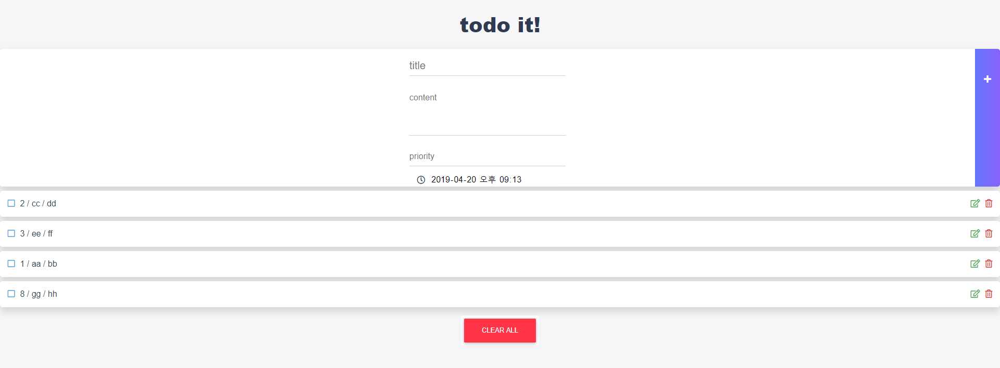

# TodoWebApp

Programmers - 2019 Summer Coding 2nd Work  

## Project Infromation
period : 2019.05.13 ~ 20  
environment : Windows 10  
tool : WebStorm  
framework : Vue.js  
Library : Material Design Bootstrap 4  
author : Einere

## About TodoWebApp
TodoWebApp is todo SPA programmed by Vue.js, Material Design Bootstrap 4.    


## Requirements
- npm

## Build

1. clone or download.
```shell
git clone https://github.com/Einere/TodoWebApp.git
```

2. go to project directory.
```shell
cd TodoWebApp
```

3. type "npm install"
```shell
npm install
```
4. type "npm run dev"
```shell
npm run dev
```
  
## Link
[데모 링크](http://summercoding2019.s3-website.ap-northeast-2.amazonaws.com/#/)  
**AWS 프리 티어의 기간 만료로 인해 접근이 불가능합니다.**
  
## Reference
Vue.js : https://kr.vuejs.org/v2/guide/index.html  
MDB : https://mdbootstrap.com/docs/vue/
